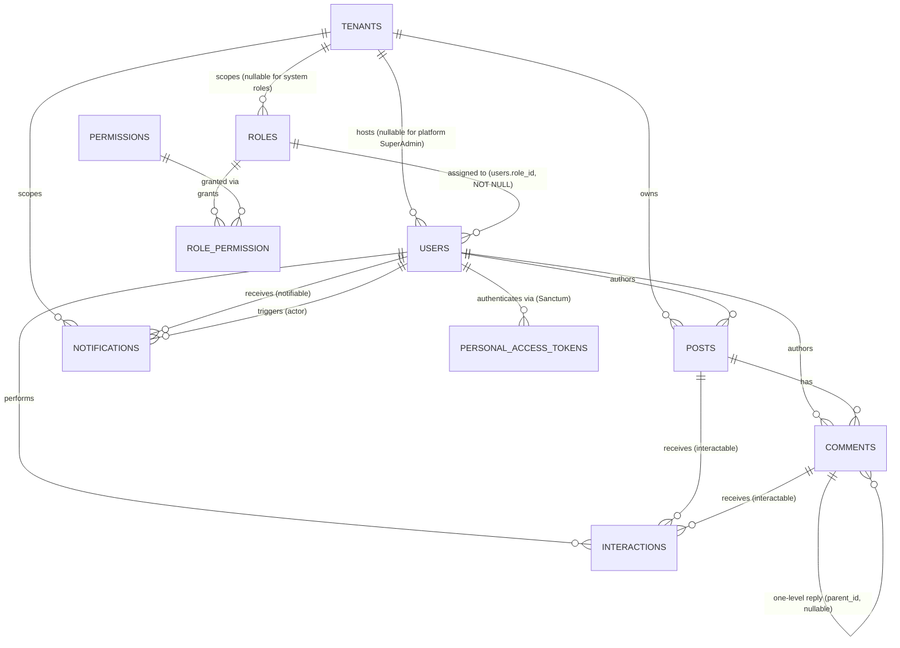

# System Architecture Blueprint — Modular Community Framework

Status: **Approved** for MVP scope (Sanctum Auth & RBAC, Feed Engine, Notification Core).

## 1. Vision

A headless commercial boilerplate sold as a software license. Buyers self-host one deployment that can host multiple communities (tenants) under it. Backend is a versioned RESTful API (Laravel 12, no Blade views); frontend is a separate Vue 3 SPA consuming that API over Sanctum bearer tokens.

## 2. Entity-Relationship Diagram



### 2.1 Core tables (Tenancy / Auth / RBAC)

| Table | Key columns | Notes |
|---|---|---|
| `tenants` | `id`, `name`, `slug` (unique), `status`, `enabled_modules` (jsonb), `settings` (jsonb) | One row = one community instance hosted by this deployment. |
| `users` | `id`, `tenant_id` (**nullable**), `role_id` (**NOT NULL**, FK → `roles.id`), `name`, `email`, `password`, `status`, `last_login_at` | `tenant_id` is the one deliberate exception to the "NOT NULL tenant_id" rule — null only for platform-level SuperAdmin accounts. Unique index `(tenant_id, email)`; partial unique index on `email WHERE tenant_id IS NULL` covers SuperAdmins. One role per user (no pivot). |
| `personal_access_tokens` | Sanctum's own migration | Not hand-rolled — shipped by `laravel/sanctum`. RBAC permission slugs are mapped into token `abilities` at issue-time as defense-in-depth. |
| `roles` | `id`, `tenant_id` (**nullable**), `name`, `slug`, `is_system` | `tenant_id = null` marks a system-wide role (`SuperAdmin`). Each tenant gets its own `TenantAdmin`/`Member` role rows, seeded on tenant creation. Unique `(tenant_id, slug)`. |
| `permissions` | `id`, `slug` (unique), `group` | Global, fixed catalog owned by the framework/modules — not tenant-editable. Each module registers its own permission slugs on boot. |
| `role_permission` | `role_id`, `permission_id` (composite PK) | Standard pivot. |

**Business rule (application-layer, not a DB constraint):** `users.tenant_id` must equal `roles.tenant_id` for that user's `role_id` (or both null for SuperAdmin). Enforced in `UserService`, not a raw FK constraint for MVP.

### 2.2 Feed engine tables

| Table | Key columns | Notes |
|---|---|---|
| `posts` | `id`, `tenant_id`, `author_id`, `body`, `visibility`, `metadata` (jsonb), `likes_count`, `comments_count`, `published_at`, `deleted_at` | Counters are denormalized, updated by the Feed module's services. `metadata` jsonb is the extensibility point for future post types without new migrations. |
| `comments` | `id`, `tenant_id`, `post_id`, `parent_id` (nullable), `author_id`, `body`, `likes_count`, `deleted_at` | **One-level nesting only**: if the target comment already has a `parent_id`, a new reply is application-forced onto that same `parent_id` (depth cap = 1). |
| `interactions` | `id`, `tenant_id`, `user_id`, `interactable_type`, `interactable_id`, `type`, `created_at` | Polymorphic — covers likes on both `posts` and `comments`. `type` enum (`like` only for MVP). Unique `(user_id, interactable_type, interactable_id, type)` prevents double-likes. |

### 2.3 Notification core table

| Table | Key columns | Notes |
|---|---|---|
| `notifications` | `id` (**uuid**, ordered/time-sortable — not Laravel's default `Notifiable` table), `tenant_id`, `notifiable_type/id`, `actor_id` (nullable), `type`, `notifiable_data` (jsonb), `read_at` | Ordered UUID (ULID-style / UUIDv7) keeps B-tree index locality on this insert-heavy table, avoiding UUIDv4 index bloat. `notifiable_data` jsonb carries whatever the frontend needs to render without extra joins. |

### 2.4 PostgreSQL-specific choices

- Feed pagination uses **keyset (cursor) pagination**: `WHERE (published_at, id) < (:cursor_published_at, :cursor_id) ORDER BY published_at DESC, id DESC LIMIT 20`, backed by composite index `(tenant_id, published_at DESC, id DESC)`.
- Partial indexes for soft-deletable tables: `CREATE INDEX ... ON posts (tenant_id, published_at) WHERE deleted_at IS NULL`.
- GIN indexes only where a jsonb path is actually queried — not applied speculatively.

## 3. Folder Structure

### Backend — `modular-framework-api` (Laravel 12)

```
app/
├── Core/                          # framework-level, not a sellable "module"
│   ├── Tenancy/{Domain,Application,Infrastructure}/
│   ├── Auth/{Domain,Application,Infrastructure,Http}/   # users, roles, permissions, Sanctum login/register
│   └── Support/                   # ApiResponse formatter, BelongsToTenant trait
├── Http/Middleware/
│   ├── ResolveTenant.php          # resolves tenant from subdomain/header before routing
│   └── EnsureModuleEnabled.php    # gates a module route by tenant's enabled_modules
└── Providers/

Modules/
├── Feed/{Domain,Application,Infrastructure,Http}/       # posts, comments, interactions
│   └── FeedServiceProvider.php
└── Notification/{Domain,Application,Infrastructure,Http}/
    ├── routes/channels.php        # broadcast channel authorization
    └── NotificationServiceProvider.php

routes/
├── api.php                        # Route::prefix('v1')->group(require api_v1.php)
└── api_v1.php                     # aggregates module route files
```

### Frontend — `modular-framework-ui` (Vue 3 + TS + Vite + Pinia)

```
src/
├── app/                           # bootstrap: main.ts, router, pinia
│   └── router/guards/authGuard.ts
├── shared/
│   ├── api/http.ts                # Axios instance + Sanctum bearer interceptor
│   ├── api/types.ts               # ApiResponse<T>, PaginationMeta
│   ├── components/ui/             # per vue-uiux-standard: Button, Skeleton, EmptyState...
│   └── types/enums.ts             # mirrors backend PHP enums as TS unions
└── modules/
    ├── auth/{api,store,types,views,components}/
    ├── feed/{api,store,types,views,components}/
    └── notifications/
        ├── realtime/echoClient.ts # Laravel Echo client (Pusher driver)
        └── {api,store,types,views,components}/
```

`src/modules/*` mirrors `Modules/*` on the backend 1:1.

## 4. API Versioning & Global Error Handling

- Every route lives under `/api/v1/...`. `routes/api.php` only does `Route::prefix('v1')->group(base_path('routes/api_v1.php'))`. A breaking change gets `api_v2.php` + versioned Resource classes; `v1` stays alive until deprecation closes.
- Response envelope on every response: `{ success, data, error, meta }`.
- Global exception mapping (`bootstrap/app.php` → `withExceptions()`):

| Exception | HTTP | `error` message |
|---|---|---|
| `AuthenticationException` (Sanctum unauthenticated) | 401 | `"Unauthenticated."` |
| Custom `RbacException` / `AuthorizationException` | 403 | `"You do not have permission to perform this action."` |
| `ModelNotFoundException` | 404 | `"Resource not found."` |
| `ValidationException` | 422 | field errors surfaced in `meta.errors` |
| `Throwable` (prod) | 500 | generic message; full trace only when `APP_DEBUG=true` |

- **Sanctum mode**: stateless Bearer tokens, not cookie/session SPA auth — buyers self-host the frontend on their own domain, so cookie/CORS same-site assumptions would break across arbitrary buyer domains. Axios interceptor attaches `Authorization: Bearer <token>` and redirects to login on `401`.

## 5. Locked Decisions Log

| # | Decision | Choice |
|---|---|---|
| 1 | Roles per user | One role per user (`users.role_id`, no pivot) |
| 2 | Comment nesting | One level only, application-enforced |
| 3 | Real-time transport | Pusher (free Sandbox tier); driver-swappable to Reverb later via `BROADCAST_CONNECTION` |
| 4 | `notifications.id` type | UUID (ordered/time-sortable) |
